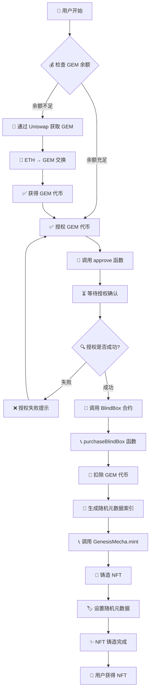
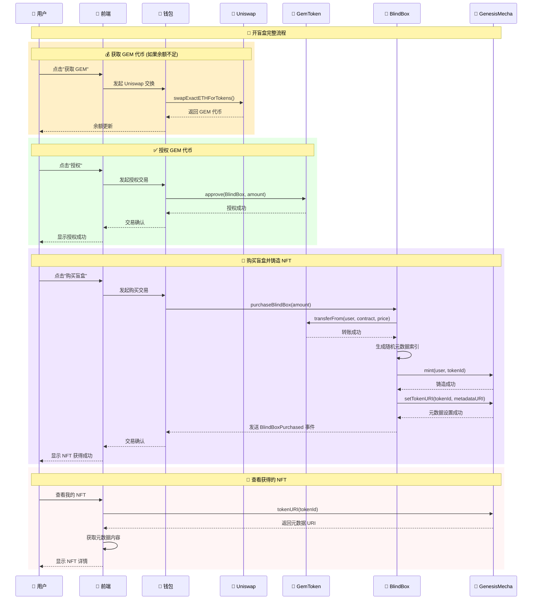

# 🎮 Genesis NFT BlindBox

> 创世纪机甲NFT盲盒系统 - 完整的Web3盲盒解决方案

## 📋 项目概述

Genesis NFT BlindBox是一个完整的NFT盲盒系统，包含智能合约、前端应用和完整的用户交互流程。用户可以使用GEM代币购买盲盒，随机获得不同稀有度的创世纪机甲NFT。

### ✨ 核心功能

- **🎲 NFT盲盒系统**: 随机铸造不同稀有度的机甲NFT
- **💎 GEM代币经济**: ERC20代币作为盲盒购买货币
- **💱 代币交换**: 集成Uniswap V2，支持ETH↔GEM交换
- **🎨 现代化前端**: 基于Next.js 15的响应式Web3应用
- **🔐 钱包集成**: 支持MetaMask等主流钱包连接

### 🎯 稀有度系统

| 稀有度 | 数量 | 比例 | 特点 |
|--------|------|------|------|
| **Legendary** | 1个 | 5% | 独一无二，最高属性，特殊动画 |
| **Epic** | 3个 | 15% | 高属性值，动画效果 |
| **Rare** | 5个 | 25% | 中等属性，特殊效果 |
| **Common** | 11个 | 55% | 基础属性，标准机甲 |

## 📁 项目结构

```
genesis-nft-blindbox/
├── contractv3/                    # 智能合约 (Hardhat v3)
│   ├── contracts/                 # Solidity合约文件
│   │   ├── GemToken.sol          # ERC20代币合约
│   │   ├── GenesisMecha.sol      # ERC721 NFT合约
│   │   └── BlindBox.sol          # 盲盒核心逻辑
│   ├── ignition/modules/         # Ignition部署配置
│   ├── scripts/                  # 部署和管理脚本
│   └── test/                     # 合约测试文件
├── frontend/                     # 前端应用 (Next.js 15)
│   ├── src/app/                  # App Router页面
│   ├── src/components/           # React组件
│   ├── src/hooks/                # 自定义Hooks
│   └── src/config/               # 配置文件
├── doc/                          # 项目文档
│   ├── 用户交互流程图.md         # 用户操作流程
│   └── 合约交互时需图.md         # 合约交互序列图
├── metadata-examples/            # NFT元数据示例
│   ├── 1.json - 20.json         # 20个NFT元数据
│   └── README.md                # 元数据说明
└── README.md                     # 项目主文档
```

## 🚀 快速开始

### 📋 环境要求

- **Node.js**: >= 22.0.0 (Hardhat v3 要求)
- **pnpm/yarn/npm**: 包管理器
- **Git**: 版本控制

### 🔧 安装依赖

```bash
# 克隆项目
git clone <repository-url>
cd genesis-nft-blindbox

# 安装合约依赖
cd contractv3
pnpm install

# 安装前端依赖
cd ../frontend
yarn install --ignore-engines
```

### ⚡ 本地开发

#### 1. 启动本地区块链网络

```bash
cd contractv3
npx hardhat node
```

#### 2. 部署智能合约

```bash
# 新终端窗口
cd contractv3
npx hardhat ignition deploy ignition/modules/GenesisNFT.ts --network localhost
```

#### 3. 启动前端应用

```bash
cd frontend
yarn dev:local
```

#### 4. 访问应用

打开浏览器访问: `http://localhost:3000`

## 🎮 用户交互流程



## 🔄 合约交互时序图

以下是完整的合约交互流程，展示了用户、前端、钱包和各个智能合约之间的详细交互：



## 🛠️ 部署指南

### 🏠 本地部署

详见[快速开始](#-快速开始)部分

### 🌐 测试网部署 (Sepolia)

#### 1. 配置环境变量

```bash
# contractv3/.env
SEPOLIA_URL=https://sepolia.infura.io/v3/your-key
PRIVATE_KEY=your-private-key
ETHERSCAN_API_KEY=your-etherscan-key
MECHA_BASE_URI=https://your-cdn.com/metadata/
```

#### 2. 部署合约

```bash
cd contractv3
npx hardhat ignition deploy ignition/modules/GenesisNFT.ts --network sepolia
```

#### 3. 配置前端

```bash
# frontend/.env.sepolia
NEXT_PUBLIC_GEM_TOKEN_ADDRESS=0x...
NEXT_PUBLIC_GENESIS_MECHA_ADDRESS=0x...
NEXT_PUBLIC_BLIND_BOX_ADDRESS=0x...
NEXT_PUBLIC_CHAIN_ID=11155111
```

#### 4. 启动前端

```bash
cd frontend
yarn dev:sepolia
```

### 🚀 Vercel部署 (推荐)

#### 方法一：通过Vercel CLI部署

1. **安装Vercel CLI**
```bash
npm i -g vercel
```

2. **登录Vercel**
```bash
vercel login
```

3. **部署项目**
```bash
cd frontend
vercel --prod
```

4. **配置构建设置**
在部署过程中，Vercel会询问配置，请按以下设置：
- **Build Command**: `yarn build:sepolia`
- **Output Directory**: `.next`
- **Install Command**: `yarn install --ignore-engines`

#### 方法二：通过Vercel Dashboard部署

1. **连接GitHub仓库**
   - 访问 [vercel.com](https://vercel.com)
   - 点击 "New Project"
   - 导入您的GitHub仓库

2. **配置项目设置**
   ```
   Framework Preset: Next.js
   Root Directory: frontend
   Build Command: yarn build:sepolia
   Output Directory: .next
   Install Command: yarn install --ignore-engines
   ```

3. **设置环境变量**
   在 Project Settings → Environment Variables 中添加：
   ```bash
   NEXT_PUBLIC_GEM_TOKEN_ADDRESS=0xe59E7f631DCf9cD76119252c3aAD396bE48F31af
   NEXT_PUBLIC_GENESIS_MECHA_ADDRESS=0x81b69A8d41345DBdb9eCee61d0eBB3921db39D66
   NEXT_PUBLIC_BLIND_BOX_ADDRESS=0xd7208262e716586661F19893Ab457C5De4a209DF
   NEXT_PUBLIC_UNISWAP_V2_ROUTER=0xeE567Fe1712Faf6149d80dA1E6934E354124CfE3
   NEXT_PUBLIC_UNISWAP_V2_FACTORY=0xF62c03E08ada871A0bEb309762E260a7a6a880E6
   NEXT_PUBLIC_WETH_ADDRESS=0xfFf9976782d46CC05630D1f6eBAb18b2324d6B14
   NEXT_PUBLIC_CHAIN_ID=11155111
   NEXT_PUBLIC_RPC_URL=https://sepolia.infura.io/v3/YOUR_INFURA_KEY
   ```

4. **部署**
   - 点击 "Deploy" 开始部署
   - 等待构建完成（约2-3分钟）

#### 🔧 部署配置详解

| 配置项 | 值 | 说明 |
|--------|-----|------|
| **Framework** | Next.js | 自动检测 |
| **Root Directory** | `frontend` | 前端代码目录 |
| **Build Command** | `yarn build:sepolia` | 使用Sepolia环境构建 |
| **Output Directory** | `.next` | Next.js默认输出目录 |
| **Install Command** | `yarn install --ignore-engines` | 忽略引擎版本检查 |
| **Node.js Version** | 22.x | Hardhat v3要求 |

#### 🌍 环境变量说明

| 变量名 | 描述 | 示例值 |
|--------|------|--------|
| `NEXT_PUBLIC_GEM_TOKEN_ADDRESS` | GEM代币合约地址 | `0xe59E7f...` |
| `NEXT_PUBLIC_GENESIS_MECHA_ADDRESS` | NFT合约地址 | `0x81b69A...` |
| `NEXT_PUBLIC_BLIND_BOX_ADDRESS` | 盲盒合约地址 | `0xd72082...` |
| `NEXT_PUBLIC_UNISWAP_V2_ROUTER` | Uniswap V2路由地址 | `0xeE567F...` |
| `NEXT_PUBLIC_UNISWAP_V2_FACTORY` | Uniswap V2工厂地址 | `0xF62c03...` |
| `NEXT_PUBLIC_WETH_ADDRESS` | WETH代币地址 | `0xfFf997...` |
| `NEXT_PUBLIC_CHAIN_ID` | 网络链ID (Sepolia) | `11155111` |
| `NEXT_PUBLIC_RPC_URL` | RPC节点URL | `https://sepolia.infura.io/v3/...` |

#### ✅ 部署成功验证

部署完成后，访问Vercel提供的URL，检查以下功能：

- [ ] 页面正常加载
- [ ] 钱包连接功能正常
- [ ] 合约地址显示正确
- [ ] 网络切换到Sepolia
- [ ] NFT展示功能正常

#### 🔄 自动部署

配置完成后，每次推送到GitHub主分支都会自动触发Vercel重新部署。

#### 🛠️ 故障排除

**常见问题及解决方案：**

1. **构建失败 - TypeScript错误**
   ```bash
   # 本地测试构建
   cd frontend
   yarn build:sepolia
   ```

2. **环境变量未生效**
   - 确保变量名以 `NEXT_PUBLIC_` 开头
   - 检查Vercel Dashboard中的环境变量设置
   - 重新部署项目

3. **钱包连接失败**
   - 检查 `NEXT_PUBLIC_CHAIN_ID` 是否正确
   - 确认RPC URL可访问

4. **合约交互失败**
   - 验证合约地址是否正确
   - 确认合约已部署到Sepolia网络

### 🚀 其他部署选项

#### 合约部署
- 使用主网RPC配置
- 确保充足的ETH余额支付Gas费
- 验证合约代码

#### 其他前端部署平台
- **Netlify**: 支持Next.js静态导出
- **AWS Amplify**: 企业级部署方案
- **自托管**: 使用Docker容器化部署

## 📊 技术栈

### 🔗 智能合约
- **Hardhat v3**: 现代化以太坊开发框架
- **Hardhat Ignition**: 声明式部署系统
- **OpenZeppelin**: 安全的智能合约库
- **viem v2**: TypeScript以太坊库

### 🎨 前端应用
- **Next.js 15**: React全栈框架
- **React 19**: 用户界面库
- **Wagmi**: React Hooks for Ethereum
- **RainbowKit**: 钱包连接组件
- **Tailwind CSS**: 实用优先的CSS框架

## 📖 详细文档

- **[合约文档](./contractv3/README.md)**: 智能合约详细说明
- **[前端文档](./frontend/README.md)**: 前端应用开发指南
- **[元数据文档](./metadata-examples/README.md)**: NFT元数据规范
- **[交互流程图](./doc/用户交互流程图.md)**: 用户操作流程
- **[合约交互图](./doc/合约交互时序图.md)**: 合约调用序列

## 🆘 故障排除

### 常见问题

1. **合约部署失败**: 检查网络配置和账户余额
2. **前端连接失败**: 确认合约地址配置正确
3. **钱包连接问题**: 检查网络ID是否匹配
4. **交易失败**: 确认Gas费设置和代币余额

### 获取帮助

- 查看详细文档
- 检查控制台错误信息
- 验证环境变量配置
- 确认网络连接状态

## 📄 许可证

MIT License - 详见 [LICENSE](LICENSE) 文件

---

<div align="center">

**🎮 开启你的创世纪机甲之旅！**

[🎯 在线演示](https://genesis-nft-blindbox.vercel.app) | [📖 详细流程图](./doc/) | [🎨 NFT元数据](./metadata-examples/)

</div>
