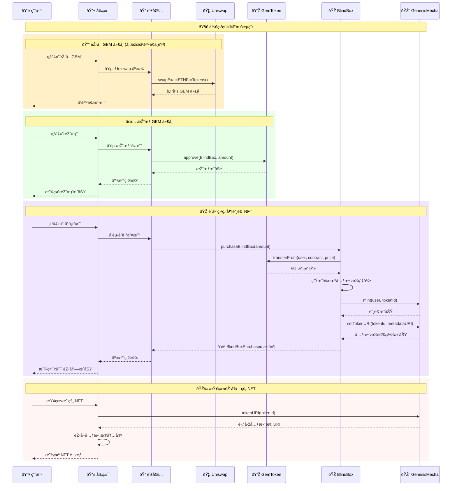

```mermaid
sequenceDiagram
    participant U as 👤 用户
    participant UI as 📱 å‰ç«¯
    participant W as 🔠钱包
    participant UNI as 🦄 Uniswap
    participant GEM as 💎 GemToken
    participant BB as 🎠BlindBox
    participant NFT as 🎨 GenesisMecha
    
    Note over U,NFT: 🚀 开盲盒完整æµç¨‹
    
    %% 1. èŽ·å– GEM 代å¸
    rect rgb(255, 240, 200)
        Note over U,UNI: 💰 èŽ·å– GEM ä»£å¸ (如果余é¢ä¸è¶³)
        U->>UI: 点击"èŽ·å– GEM"
        UI->>W: å‘èµ· Uniswap 交æ¢
        W->>UNI: swapExactETHForTokens()
        UNI-->>W: 返回 GEM 代å¸
        W-->>U: ä½™é¢æ›´æ–°
    end
    
    %% 2. æŽˆæƒ GEM 代å¸
    rect rgb(230, 255, 230)
        Note over U,GEM: ✅ æŽˆæƒ GEM 代å¸
        U->>UI: 点击"授æƒ"
        UI->>W: å‘起授æƒäº¤æ˜“
        W->>GEM: approve(BlindBox, amount)
        GEM-->>W: 授æƒæˆåŠŸ
        W-->>UI: 交易确认
        UI-->>U: 显示授æƒæˆåŠŸ
    end
    
    %% 3. 购买盲盒
    rect rgb(240, 230, 255)
        Note over U,NFT: 🎠购买盲盒并铸造 NFT
        U->>UI: 点击"购买盲盒"
        UI->>W: å‘起购买交易
        W->>BB: purchaseBlindBox(amount)
        
        BB->>GEM: transferFrom(user, contract, price)
        GEM-->>BB: 转账æˆåŠŸ
        
        BB->>BB: 生æˆéšæœºå…ƒæ•°æ®ç´¢å¼•
        
        BB->>NFT: mint(user, tokenId)
        NFT-->>BB: 铸造æˆåŠŸ
        
        BB->>NFT: setTokenURI(tokenId, metadataURI)
        NFT-->>BB: 元数æ®è®¾ç½®æˆåŠŸ
        
        BB-->>W: å‘é€ BlindBoxPurchased 事件
        W-->>UI: 交易确认
        UI-->>U: 显示 NFT 获得æˆåŠŸ
    end
    
    %% 4. 查看结果
    rect rgb(255, 245, 245)
        Note over U,NFT: 🎉 查看获得的 NFT
        U->>UI: 查看我的 NFT
        UI->>NFT: tokenURI(tokenId)
        NFT-->>UI: è¿”å›žå…ƒæ•°æ® URI
        UI->>UI: 获å–元数æ®å†…容
        UI-->>U: 显示 NFT 详情
    end
```