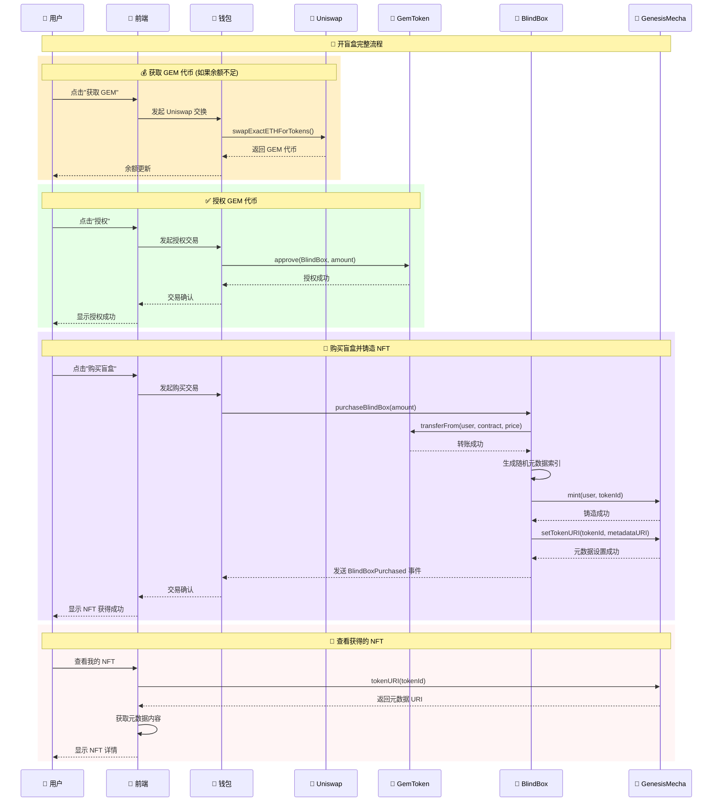

```mermaid
sequenceDiagram
    participant U as 👤 用户
    participant UI as 📱 前端
    participant W as 🔐 钱包
    participant UNI as 🦄 Uniswap
    participant GEM as 💎 GemToken
    participant BB as 🎁 BlindBox
    participant NFT as 🎨 GenesisMecha
    
    Note over U,NFT: 🚀 开盲盒完整流程
    
    %% 1. 获取 GEM 代币
    rect rgb(255, 240, 200)
        Note over U,UNI: 💰 获取 GEM 代币 (如果余额不足)
        U->>UI: 点击"获取 GEM"
        UI->>W: 发起 Uniswap 交换
        W->>UNI: swapExactETHForTokens()
        UNI-->>W: 返回 GEM 代币
        W-->>U: 余额更新
    end
    
    %% 2. 授权 GEM 代币
    rect rgb(230, 255, 230)
        Note over U,GEM: ✅ 授权 GEM 代币
        U->>UI: 点击"授权"
        UI->>W: 发起授权交易
        W->>GEM: approve(BlindBox, amount)
        GEM-->>W: 授权成功
        W-->>UI: 交易确认
        UI-->>U: 显示授权成功
    end
    
    %% 3. 购买盲盒
    rect rgb(240, 230, 255)
        Note over U,NFT: 🎁 购买盲盒并铸造 NFT
        U->>UI: 点击"购买盲盒"
        UI->>W: 发起购买交易
        W->>BB: purchaseBlindBox(amount)
        
        BB->>GEM: transferFrom(user, contract, price)
        GEM-->>BB: 转账成功
        
        BB->>BB: 生成随机元数据索引
        
        BB->>NFT: mint(user, tokenId)
        NFT-->>BB: 铸造成功
        
        BB->>NFT: setTokenURI(tokenId, metadataURI)
        NFT-->>BB: 元数据设置成功
        
        BB-->>W: 发送 BlindBoxPurchased 事件
        W-->>UI: 交易确认
        UI-->>U: 显示 NFT 获得成功
    end
    
    %% 4. 查看结果
    rect rgb(255, 245, 245)
        Note over U,NFT: 🎉 查看获得的 NFT
        U->>UI: 查看我的 NFT
        UI->>NFT: tokenURI(tokenId)
        NFT-->>UI: 返回元数据 URI
        UI->>UI: 获取元数据内容
        UI-->>U: 显示 NFT 详情
    end
```