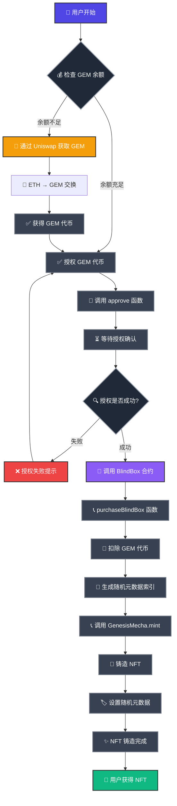

```mermaid
graph TD
    A[👤 用户开始] --> B{💰 检查 GEM 余额}
    
    B -->|余额不足| C[🔄 通过 Uniswap 获取 GEM]
    B -->|余额充足| F[✅ 授权 GEM 代币]
    
    C --> D[💱 ETH → GEM 交换]
    D --> E[✅ 获得 GEM 代币]
    E --> F
    
    F --> G[📝 调用 approve 函数]
    G --> H[⏳ 等待授权确认]
    H --> I{🔍 授权是否成功?}
    
    I -->|失败| J[❌ 授权失败提示]
    I -->|成功| K[🎁 调用 BlindBox 合约]
    
    J --> F
    
    K --> L[📞 purchaseBlindBox 函数]
    L --> M[💸 扣除 GEM 代币]
    M --> N[🎲 生成随机元数据索引]
    N --> O[📞 调用 GenesisMecha.mint]
    O --> P[🎨 铸造 NFT]
    P --> Q[🏷️ 设置随机元数据]
    Q --> R[✨ NFT 铸造完成]
    R --> S[🎉 用户获得 NFT]
    
    style A fill:#4f46e5,stroke:#333,stroke-width:2px,color:#fff
    style S fill:#10b981,stroke:#333,stroke-width:2px,color:#fff
    style C fill:#f59e0b,stroke:#333,stroke-width:2px,color:#fff
    style K fill:#8b5cf6,stroke:#333,stroke-width:2px,color:#fff
    style J fill:#ef4444,stroke:#333,stroke-width:2px,color:#fff
    
    classDef processBox fill:#374151,stroke:#6b7280,stroke-width:2px,color:#fff
    classDef decisionBox fill:#1f2937,stroke:#9ca3af,stroke-width:2px,color:#fff
    classDef successBox fill:#065f46,stroke:#10b981,stroke-width:2px,color:#fff
    classDef errorBox fill:#7f1d1d,stroke:#ef4444,stroke-width:2px,color:#fff
    
    class B,I decisionBox
    class E,F,G,H,L,M,N,O,P,Q,R processBox
    class S successBox
    class J errorBox
```